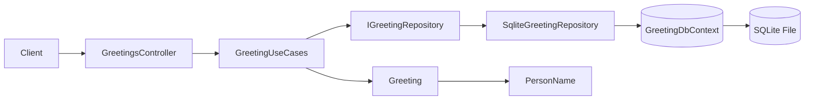
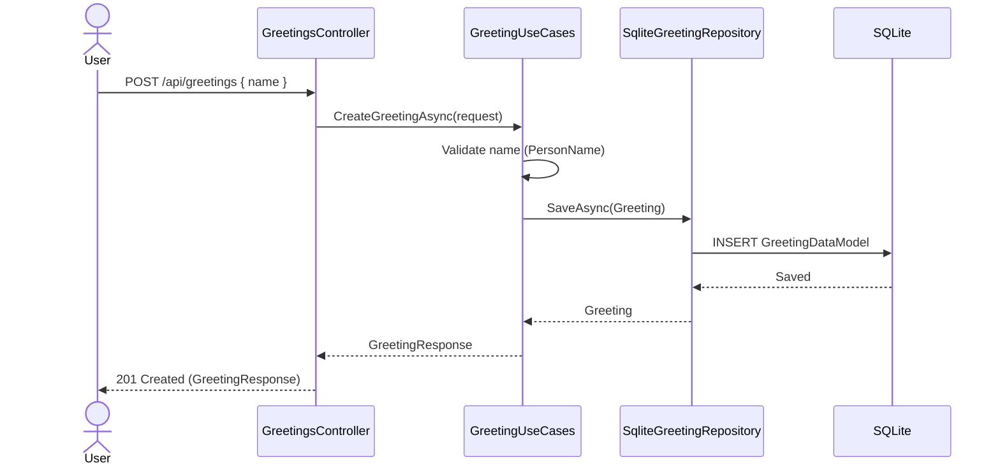
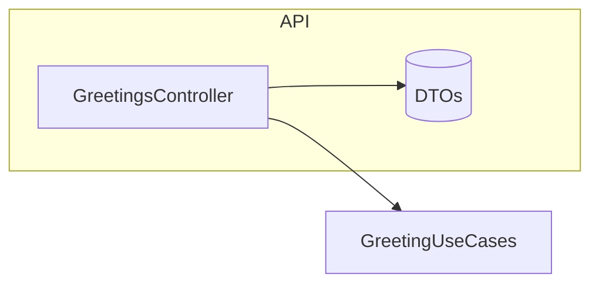
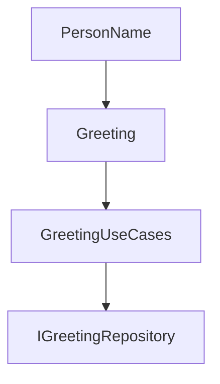
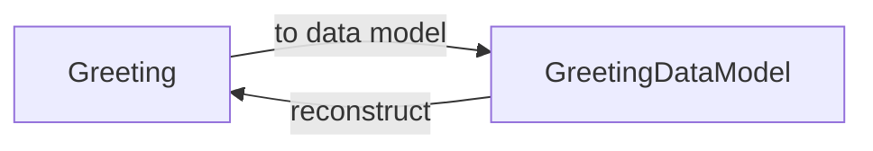
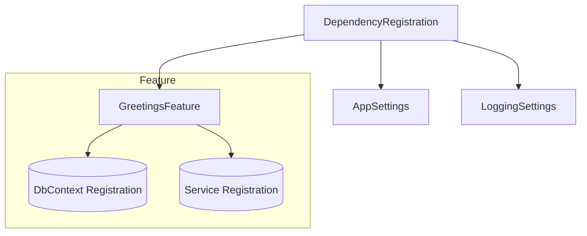
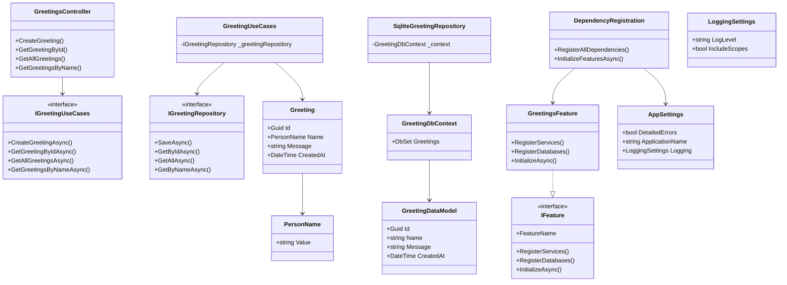

# Architecture and Class Documentation

This document explains the architectural concepts, layers, and class responsibilities that make up the application. It is organized by architectural layer to show separation of concerns and interaction boundaries.

## Table of Contents

- [Architectural Concepts](#architectural-concepts)
- [Solution Structure](#solution-structure)
- [Cross-Layer Request Flow](#cross-layer-request-flow)
- [API Layer](#api-layer)
- [Domain Layer](#domain-layer)
- [Data Layer](#data-layer)
- [Shared Infrastructure Layer](#shared-infrastructure-layer)
- [Feature Composition](#feature-composition)
- [Per-Layer Class Reference](#per-layer-class-reference)
- [End-to-End Class Relationship Diagram](#end-to-end-class-relationship-diagram)
- [Extending the System](#extending-the-system)
- [Guidelines](#guidelines)

## Architectural Concepts

| Concept | Summary | Purpose |
|---------|---------|---------|
| Feature-Based (Vertical Slice) | Organizes code by feature instead of technical layer first | Improves cohesion and reduces cross-feature coupling |
| Domain-Centric | Domain model (entities + value objects) independent of infrastructure | Enables testability and adaptability |
| Dependency Inversion | Outer layers depend on inner abstractions | Keeps domain pure; infrastructure is replaceable |
| Explicit Use Cases | `GreetingUseCases` mediates between API and persistence | Provides a stable application service boundary |
| Repository Pattern | Abstracts persistence behind `IGreetingRepository` | Hides EF Core specifics from domain logic |
| Value Objects | Encapsulate validation + invariants (`PersonName`) | Prevents invalid primitive values from leaking |
| Initialization Hook | `IFeature.InitializeAsync` for DB creation/seeding | Consistent runtime setup per feature |

## Solution Structure

```text
Services/
 └── Greetings/
      ├── Api/        (controllers + DTOs)
      ├── Domain/     (entities, value objects, use cases, interfaces)
      └── Data/       (DbContext, models, repositories)
Shared/
 ├── DependencyInjection/
 └── Interfaces/
```

## Cross-Layer Request Flow

The following diagram shows how a POST request propagates through the system.



### Sequence Diagram



## API Layer

Focus: HTTP transport, routing, model binding, response shaping. No business rules.

Key responsibilities:

- Translate HTTP requests to application requests (DTO to use case inputs)
- Select status codes and response models
- Delegate all logic to use cases



### API Components

| Name | Type | Purpose |
|------|------|---------|
| `GreetingsController` | Controller | Exposes REST endpoints and legacy `/hello` endpoint |
| `CreateGreetingRequest` | DTO (input) | Captures input data for greeting creation |
| `GreetingResponse` | DTO (output) | Serialized response object |

## Domain Layer

Focus: Business meaning of a “Greeting” and valid operations.

Principles:

- No dependencies on EF Core or ASP.NET Core
- Validation lives in constructors / value objects
- Use cases return stable DTO shapes (mapping boundary)



### Domain Components

| Name | Type | Purpose |
|------|------|---------|
| `PersonName` | Value Object | Ensures non-empty, trimmed, <=100 chars |
| `Greeting` | Entity | Aggregates identity + derived message + timestamp |
| `IGreetingRepository` | Interface | Persistence abstraction |
| `IGreetingUseCases` | Interface | Application boundary for controller |
| `GreetingUseCases` | Service | Implements creation + queries |

### Example Domain Flow (Create)

1. Controller constructs `CreateGreetingRequest`.
2. Use case validates `request.Name` via `PersonName`.
3. Creates `Greeting` entity (derives `Message`).
4. Persists via repository.
5. Maps entity to `GreetingResponse`.

## Data Layer

| Component | File | Responsibility |
|----------|------|----------------|
| EF Core Context | `GreetingDbContext` | Defines `DbSet<GreetingDataModel>`, configures entity mapping, indexes, constraints. |
| Data Model | `GreetingDataModel` | Persistence representation (flattened) of a greeting. No domain behavior. |
| Repository Interface | `IGreetingRepository` (in Domain) | Abstraction for persistence operations (save, query by id/name/all). |
| Repository Implementation | `SqliteGreetingRepository` | Maps domain entity ↔ data model, executes EF Core queries. |

### Mapping Strategy



Domain entity (`Greeting`) is converted to `GreetingDataModel` inside the repository. Rehydration uses `Greeting.Reconstruct` to avoid bypassing invariants.

## Shared Infrastructure Layer

Responsibilities that are not feature-specific:

- Service registration abstraction (`DependencyRegistration`)
- Feature contract (`IFeature`)
- Configuration binding (`AppSettings`, `LoggingSettings`)



## Feature Composition

Each feature supplies:

1. Database registration (`RegisterDatabases`)
2. Service registration (`RegisterServices`)
3. Optional runtime init (`InitializeAsync`)

This enables isolated evolution and potential extraction to a microservice.

## Per-Layer Class Reference

### Program / Hosting

- `Program.cs` – sets up host, invokes registration, maps endpoints, triggers feature initialization.

### Dependency / Configuration

- `DependencyRegistration` – central registrar (core, third-party, features).
- `AppSettings`, `LoggingSettings` – typed configuration models.
- `IFeature` – contract implemented by `GreetingsFeature`.
- `GreetingsFeature` – feature-specific composition root.

### Domain

- `PersonName` – value object.
- `Greeting` – entity.
- `IGreetingRepository`, `IGreetingUseCases` – abstractions.
- `GreetingUseCases` – application service.

### Data

- `GreetingDbContext` – EF Core context.
- `GreetingDataModel` – persistence model.
- `SqliteGreetingRepository` – repository implementation.

### API

- `GreetingsController` – HTTP endpoints.
- `CreateGreetingRequest`, `GreetingResponse` – DTOs.

## End-to-End Class Relationship Diagram



## Extending the System

To add a new feature:

1. Create folder under `Services/<FeatureName>` with `Api`, `Domain`, `Data` subfolders.
2. Implement domain entities/value objects and interfaces.
3. Implement repository + DbContext (if persistence needed).
4. Add `<FeatureName>Feature` implementing `IFeature`.
5. Register feature in `GetAllFeatures()` (or implement reflection-based discovery).
6. Expose endpoints via a controller returning DTOs.

## Guidelines

- Keep domain logic free of EF Core or HTTP abstractions.
- Use value objects for constrained primitives.
- Keep repositories thin: translate and persist.
- Use `InitializeAsync` for migrations, seeding, cache warm-up.

---
Generated technical documentation file.
